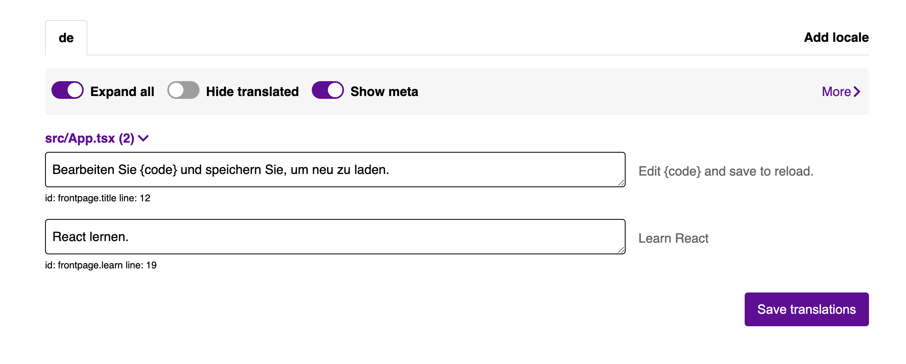

# NextJS with git18n and react-intl

## Installation

Install the dependencies:

```shell
yarn add react-intl
```

And:

```shell
yarn add -D git18n
```

Get the access token (`GIT18N_SECRET_PROJECT_KEY`) on [git18n](https://git18n.com/) and add it to `.env` or as environmental variable (for production build environments).

Add translation script to `package.json`:

```json
"scripts": {
  "translate": "git18n --files 'src/**/*.js*'"
}
```

Running `yarn translate` will fetch translations from server and put in `.locales` and add strings for translations.

## Setup

Create `src/i18n.ts` for configuring `react-intl` and importing translations from [git18n](https://git18n.com/):

```ts
export const defaultLocale = 'en';

const locales = ['en', 'de'];

export const messages = locales.reduce((acc, cur) => {
  try {
    acc[cur] = require(`../.locales/${cur}.json`);
  } catch {}
  return acc;
}, {} as Record<string, Record<string, string>>);
```

Add `react-intl` to `src/index.ts`:

```ts
import { IntlProvider } from 'react-intl';
import { defaultLocale, messages, locales } from './i18n';

// Language selection
const userLocale = navigator.language.split('-')[0]; // only match 2 chararcter language codes
const locale = locales.includes(userLocale) ? userLocale : defaultLocale; // defaultLocale as fallback

const root = ReactDOM.createRoot(document.getElementById('root') as HTMLElement);
root.render(
  <React.StrictMode>
    <IntlProvider defaultLocale={defaultLocale} locale={locale} messages={messages[locale]}>
      <App />
    </IntlProvider>
  </React.StrictMode>,
);
```

## Additional

Add `yarn translate` to build command:

```json
"scripts": {
  "build": "yarn translate && react-scripts build",
}
```

Add `.locales` in `.gitignore`, if ESLint complains just create an empty `.locales` folder. If wanting to remove `git18n`, just uninstall the NPM package and import the translation files manually from `.locales` folder.

This is everything required to be able to easily managed translations on [git18n](https://git18n.com/):


